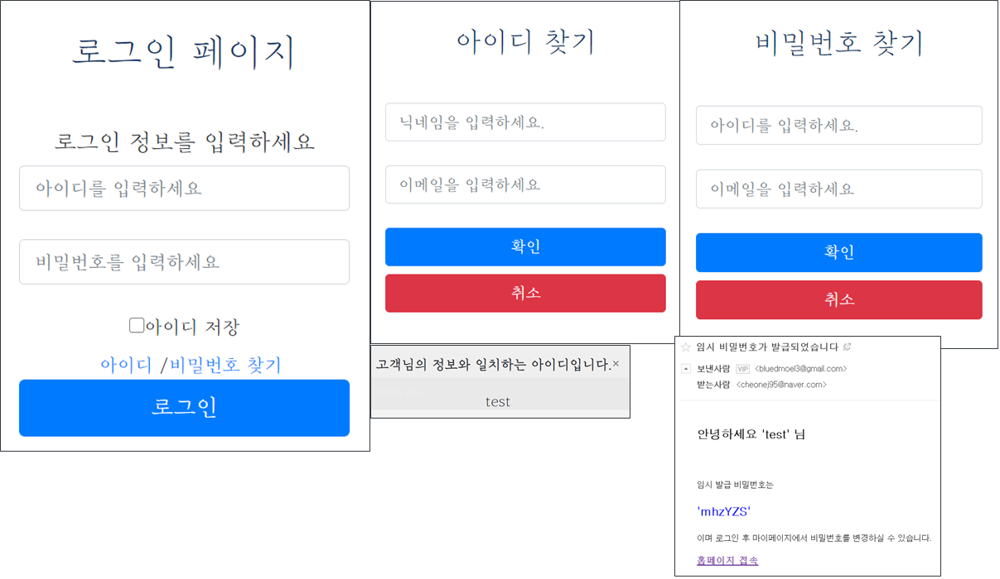

# TourProject

</img>

## 프로젝트 기획의도

여행을 갈때 즉흥적으로 장소를 정하고 가는 사람도 있지만 여행 계획을 짜고 가는 사람도 있습니다.   
어디를 가서 무엇을 먹고 무엇을 할지 혹은 여행의 테마를 정하고 떠나는 사람도 있습니다.    
친구 혹은 가족, 연인 끼리에 따라 같은 장소여도 같이 가는 사람에 따라 코스가 바뀝니다.   
그래서 우리들은 여행지를 테마, 같이 가는 사람등 다양한 요소를 적용해 여행지를 추천해주는 웹 사이트를 만들고자 하였습니다.   
*** 

제작:    
[팀장.장민규](https://github.com/Dokkabei97),   
[부팀장.고은주](https://github.com/koeunju),   
[정성모](https://github.com/JeongSM94),    
[지윤성](https://github.com/YunSeong-Ji),    
[천은지](https://github.com/cheonej95)

***

# 1등 최우수팀 
## 우리팀 모두 수고했어!!

</img>

***

## 설계
</img>

***
## 프로젝트 페이지 별 설명

- 메인 페이지 
- 로그인 페이지 (비밀번호 찾기시 메일을 통한 임시 비밀번호 발급)
- 회원가입 페이지 (메일인증을 통한 회원가입 진행 + SHA256암호화 방식 + 정규식으로 유효성검사)
- 게시판 페이지 (여행지 추천, 자유게시판은 로그인 회원만 사용 가능하며 글 작성시 포인트 제공)
- 상품 페이지 (유저간 여행지 추천을 활성화 하기위해 포인트를 제공하며 포인트는 상품으로 교환 가능)
- 여행지 페이지 (공공데이터 TourAPI 사용 JSON형식으로 데이터를 받아오고 Ajax통신으로 비동기 방식으로 바로 여행지 검색시 출력)
- 리뷰 페이지 (여행지를 검색 후 그 여행지에 대한 간단 리뷰 작성)
- 마이 페이지 (유저 자신이 쓴 글, 저장한 여행지 조회 가능하며 비밀번호 변경시 Ajax통신을 이용해 비동기 방식으로 기존 비밀번호 체크 후 변경)
- 어드민 페이지 (어드민 전용 페이지로 상품등록, 유저 정보 수정,삭제 가능)

***

## 프로젝트 사진으로 빠르게 훑어보기

</img>   
</img>   
</img>   
</img>   
</img>   
</img>   
</img>   
</img>   
